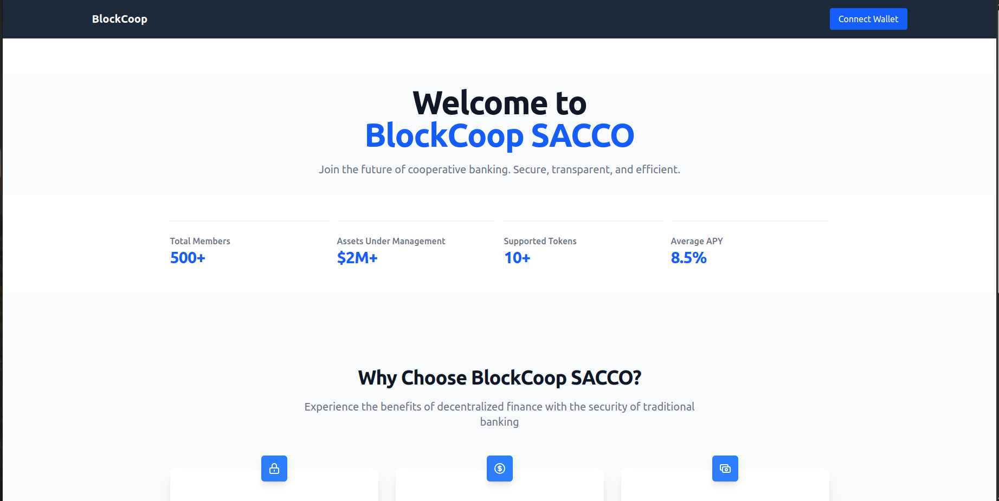
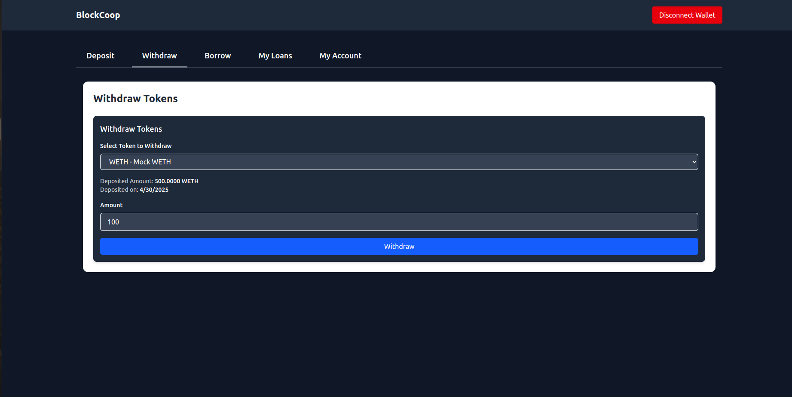
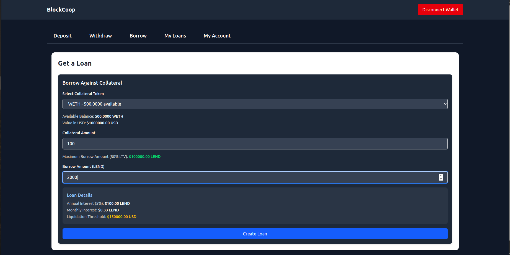
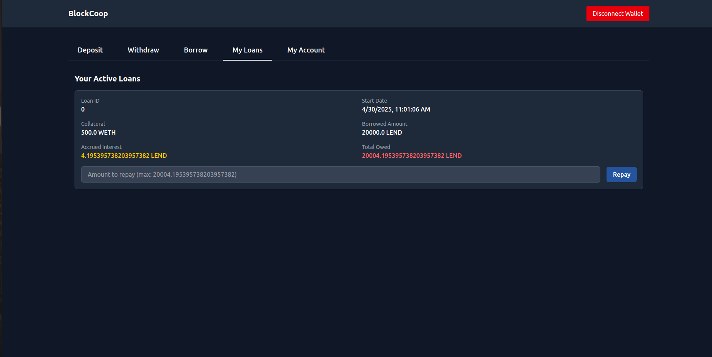
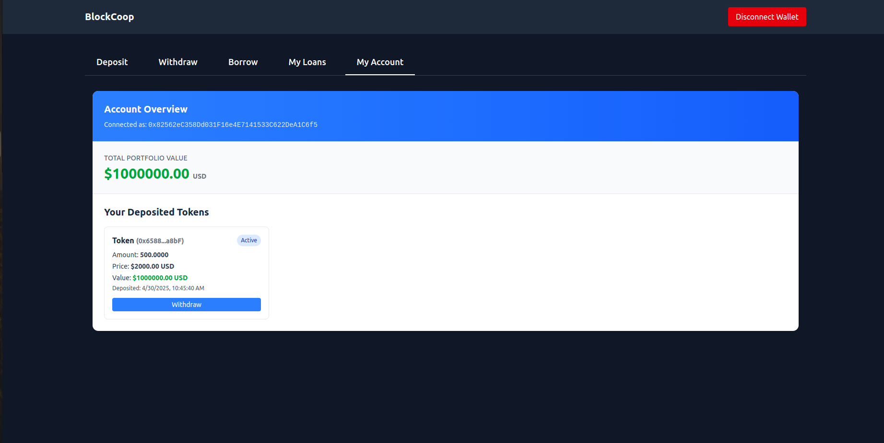

# BlockCoopTokens




A decentralized token lending and borrowing platform built with robust governance, risk management, and price feed integration. BlockCoop enables communities to create cooperative-based financial services with advanced DeFi capabilities.

## 🚀 Live Versions

**Main Production Version**:
{todo}

**Pharos Network DevNet Version**: [BlockCoop Pharos Integration](https://block-coop-sacco-pharos.vercel.app) - Special integration created for the Pharos Network hackathon, showcasing our adaptability and commitment to the Pharos ecosystem.

## 📋 Overview

BlockCoop is a comprehensive DeFi protocol that enables users to deposit various ERC20 tokens as collateral and borrow against them.

### Key Features

- **Multi-Token Support**: Deposit and borrow against various whitelisted tokens
- **Oracle Integration**: Secure price feeds for accurate valuations
- **Risk Management**: Configurable Loan-to-Value ratios and liquidation thresholds
- **User-Friendly Interface**: Intuitive dashboard for managing deposits and loans

## 🖥️ User Interface & Navigation

### Dashboards

<!--  -->

The user dashboard provides an overview of:

- Deposit tab to deposit whitelisted tokens as collateral
  
- Withdraw tab to withdraw whitelisted tokens that are not being used as collateral
  
- Borrow tab to borrow loans against their collateral
  
- My Loans tab to view their active loans
  
- My Account tab to view their token deposits and their USD value
  

### Deposit Flow

1. Select the token you wish to deposit from the dropdown menu on the Deposit tab
2. Enter the amount you want to deposit
3. Approve the token spending (first transaction)
4. Confirm your deposit (second transaction)
5. Your deposit will appear in the My Account tab immediately after confirmation

### Borrowing Flow

1. Navigate to the Borrow tab
2. Select the collateral token and amount you want to use
3. Enter the amount you wish to borrow (system will show your maximum available)
4. Confirm the transaction
5. The borrowed amount will be sent to your wallet

### Portfolio Management

Track and manage your:

- Active deposits on the My Account tab (This is for the tokens you have deposited as collateral)
- Current loans and their interest accrual on the My Loans tab

## 🧰 Smart Contracts

### Main Contract: BlockCoopTokens(0x5aCe9a0B4b8EE9255d5F2266bE3a9780ebE28a49)

The core contract handling deposits, loans, and protocol governance.

#### Key Parameters

- **LTV_RATIO**: 50% (5000 basis points) - Maximum loan-to-value ratio
- **LIQUIDATION_THRESHOLD**: 75% (7500 basis points) - Threshold for liquidation
- **INTEREST_RATE**: 5% annual (500 basis points)
- **MAX_ITERATION_COUNT**: 100 - Maximum tokens to process in a single view function call

### Support Contracts

#### MockPriceFeed (for testing) (0xA1CBEe55b7f8B7A161528B44b27196671a09DEe2)

A test contract that mimics Chainlink's AggregatorV3Interface for development and testing purposes.

```solidity
// SPDX-License-Identifier: MIT
pragma solidity ^0.8.19;

contract MockPriceFeed {
    int256 public price = 200000000000;
    uint256 public updatedAt = block.timestamp;
    uint80 public roundId = 1;
    uint256 public startedAt = block.timestamp;
    uint80 public answeredInRound = 1;

    // Returns mock price data in Chainlink format
    function latestRoundData()
        external
        view
        returns (uint80, int256, uint256, uint256, uint80)
    {
        return (roundId, price, startedAt, block.timestamp, answeredInRound);
    }

    // Updates the mock price
    function setPrice(int256 _price) external {
        price = _price;
        updatedAt = block.timestamp;
        roundId++;
        answeredInRound = roundId;
    }
}
```

#### DemoToken (for testing)(lendTokenAddress - 0xB1BF661cf9C19cb899400B0E62D8fc87AA3a22C6) (depositTokenAddress - 0x6588DC27Caa6314A8f99321b5cCB7c1977E1a8bF)

A simple ERC20 token implementation for testing the protocol.

```solidity
// SPDX-License-Identifier: MIT
pragma solidity ^0.8.19;
import "@openzeppelin/contracts/token/ERC20/ERC20.sol";

contract DemoToken is ERC20 {
    constructor(string memory name, string memory symbol) ERC20(name, symbol) {
        _mint(msg.sender, 1000000 * 10 ** 18);
    }
}
```

## 📊 Contract Integration with Pharos Network

For the Pharos Network DevNet integration, we've made specific adaptations:

1. **Optimized Gas Usage**: Refactored loops and storage patterns to reduce gas costs on Pharos
2. **Created our own mock price oracle**: Modified price feed implementations to work seamlessly with Pharos Network
3. **Created two mock tokens one for lending(LEND) and one for deposit(WETH)**

The integration demonstrates our commitment to supporting emerging blockchain infrastructures while maintaining the core functionality that makes BlockCoop powerful.

## 🔧 Technical Usage

### For Users

1. **Deposit Tokens**

   ```solidity
   function deposit(address _tokenAddress, uint256 _amount) external
   ```

   Deposit whitelisted ERC20 tokens as collateral.

2. **Withdraw Tokens**

   ```solidity
   function withdraw(address _tokenAddress, uint256 _amount) external
   ```

   Withdraw tokens that aren't being used as active collateral.

3. **Borrow**

   ```solidity
   function borrow(address _collateralToken, uint256 _collateralAmount, uint256 _borrowAmount) external
   ```

   Borrow lending tokens against your collateral.

4. **Repay**
   ```solidity
   function repay(uint256 _loanId, uint256 _repayAmount) external
   ```
   Repay your loan to release collateral.

### For Administrators

1. **Whitelist Tokens**

   ```solidity
   function whitelistToken(address _tokenAddress, address _priceFeed) external
   ```

   Add support for new collateral tokens with associated price feeds.

2. **Update Price Feeds**

   ```solidity
   function updatePriceFeed(address _tokenAddress, address _newPriceFeed) external
   ```

   Update the price feed for a whitelisted token.

3. **Fund Manager Management**

   ```solidity
   function addFundManager(address _manager) external
   function removeFundManager(address _manager) external
   ```

   Add or remove accounts with fund manager privileges.

4. **Emergency Controls**

   ```solidity
   function pause() external
   function unpause() external
   ```

   Pause and unpause protocol operations in case of emergencies.

5. **Lending Pool Management**
   ```solidity
   function fundLendingPool(uint256 _amount) external
   ```
   Add funds to the lending pool.

## 🔍 View Functions

- `getTokensInfo`: Get details about whitelisted tokens
- `getUserTotalValueUSD`: Calculate a user's total deposited value
- `getTokenPrice`: Get the current price of a token from its price feed
- `getUserDepositedTokens`: Get all tokens deposited by a user
- `getWhitelistedTokenCount`: Get the count of whitelisted tokens
- `getAllActiveFundManagers`: Get all active fund managers

## 🔒 Security Features

- **ReentrancyGuard**: Protection against reentrancy attacks
- **Pausable**: Emergency pause functionality
- **Ownership Management**: Secure owner transitions
- **Price Feed Validation**: Checks for stale or invalid price data
- **Error Handling**: Comprehensive error messages for transparent operation

## 💻 Development & Deployment

### Local Development Setup

1. Clone the repository:

   ```bash
   git clone https://github.com/CECILIA-MULANDI/BlockCoop-Sacco-Pharos.git
   cd final_record/blockcoop-frontend/
   ```

2. Install dependencies:

   ```bash
   npm install
   ```

3. Start local development:
   ```bash
   npm run dev
   ```

### Deploying to Pharos Network DevNet

1. Set up your environment variables:

   ```
   # Edit .env with your private key and Pharos DevNet RPC
   ```

2. Deploy contracts:

   ```bash
   BlockCoopTokens - npx hardhat run scripts/verify/deployBlocktokens.js --network pharosDevnet
   MockPriceFeed - npx hardhat run scripts/verify/deployMockPriceFeed.js --network pharosDevnet
   DemoToken - npx hardhat run scripts/verify/deployDemoToken.js --network pharosDevnet
   ```

3. Verify contracts:
   ```bash
   npx hardhat verify --network pharosDevnet <CONTRACT_ADDRESS>
   ```
   st

## 📜 License

MIT
